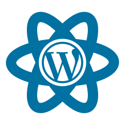

# CURSO DE WORDPRESS
👨‍⚖️WORDPRESS É UMA PLATAFORMA DE GERENCIAMENTO DE CONTEÚDO WEB (SITES).

  

## CONCEITO:
WordPress é uma plataforma de código aberto (open source) para criação e gerenciamento de websites e blogs. Ele é escrito principalmente em PHP e usa um banco de dados MySQL ou MariaDB para armazenar conteúdo. Lançado pela primeira vez em 2003 por Matt Mullenweg e Mike Little, o WordPress tornou-se uma das plataformas de gerenciamento de conteúdo mais populares e amplamente utilizadas na internet.

1. **CMS (Content Management System):** O WordPress é um sistema de gerenciamento de conteúdo que permite aos usuários criar, editar, publicar e gerenciar facilmente o conteúdo de um site. Ele oferece uma interface intuitiva baseada na web para adicionar e modificar páginas, posts, imagens e outros elementos de conteúdo.

2. **Tema (Theme):** Um tema é um conjunto de arquivos que define a aparência e o layout de um site WordPress. Os temas permitem personalizar a aparência visual de um site sem modificar o conteúdo subjacente. Existem milhares de temas disponíveis para WordPress, desde temas gratuitos até temas premium com recursos avançados de personalização.

3. **Plugin:** Um plugin é um componente de software que adiciona recursos e funcionalidades extras a um site WordPress. Existem milhares de plugins disponíveis para WordPress, abrangendo uma ampla variedade de funcionalidades, como SEO (Search Engine Optimization), segurança, formulários de contato, comércio eletrônico, integração de mídias sociais e muito mais.

4. **Post e Página:** No WordPress, um post é um tipo de conteúdo utilizado para criar artigos, notícias, atualizações e outros tipos de conteúdo dinâmico que são exibidos em ordem cronológica inversa no site. Uma página é semelhante a um post, mas geralmente é usada para conteúdo estático, como páginas de contato, sobre nós e serviços.

5. **Editor de Bloco (Block Editor):** O WordPress introduziu o editor de bloco (também conhecido como Gutenberg) em 2018. Ele oferece uma experiência de edição mais visual e flexível, permitindo que os usuários criem conteúdo usando blocos de diferentes tipos, como parágrafos de texto, imagens, galerias, vídeos e muito mais.

## FUNCIONAMENTO:
- Após instalar o WordPress em um servidor web, os usuários podem acessar o painel de administração para começar a criar e gerenciar conteúdo.
- Eles podem escolher um tema para personalizar a aparência do site e instalar plugins para adicionar funcionalidades extras conforme necessário.
- O conteúdo pode ser criado e editado usando o editor de bloco ou o editor clássico.
- Os posts e páginas podem ser organizados em categorias e tags para facilitar a navegação e a descoberta de conteúdo.
- O WordPress oferece recursos de SEO integrados, permitindo que os usuários otimizem seus sites para mecanismos de busca.
- Os comentários podem ser habilitados para permitir interação com os visitantes do site.
- O WordPress também suporta múltiplos usuários e permissões, permitindo que várias pessoas trabalhem juntas na criação e gerenciamento do site.

## SUA HISTÓRIA:
O WordPress é uma plataforma de gerenciamento de conteúdo (CMS - Content Management System) que foi lançada pela primeira vez em 2003. Foi desenvolvido por Matt Mullenweg e Mike Little como um fork do projeto b2/cafelog. O objetivo era criar uma plataforma simples e fácil de usar para a criação e gerenciamento de blogs.

A primeira versão do WordPress, conhecida como WordPress 0.7, foi lançada em maio de 2003. Desde o início, o WordPress ganhou popularidade rapidamente, graças à sua interface intuitiva, facilidade de uso e uma comunidade ativa de desenvolvedores e usuários.

Nos anos seguintes, o WordPress continuou a evoluir. Foram lançadas novas versões com recursos aprimorados, como a capacidade de instalar plugins para adicionar funcionalidades extras e a introdução de temas para personalizar a aparência dos sites.

Em 2005, o WordPress lançou a versão 2.0, que trouxe melhorias significativas na interface de usuário e no sistema de plugins. Essas atualizações ajudaram a impulsionar ainda mais a popularidade do WordPress e expandir sua base de usuários.

Com o tempo, o WordPress deixou de ser apenas uma plataforma de blogs e se tornou um CMS robusto para a criação de sites completos. Empresas, organizações e indivíduos começaram a usar o WordPress para construir sites de todos os tipos, desde blogs pessoais até grandes sites corporativos.

Em 2010, o WordPress introduziu o recurso de personalização de temas, permitindo que os usuários modificassem a aparência de seus sites sem a necessidade de conhecimentos de programação. Isso tornou o WordPress ainda mais acessível para usuários não técnicos.

Em 2011, o WordPress lançou a versão 3.0, que introduziu o recurso de tipos de postagem personalizados. Isso permitiu que os usuários estendessem a funcionalidade do WordPress além de postagens e páginas, abrindo possibilidades para criar sites mais complexos, como portfólios, sites de comércio eletrônico e redes sociais.

Ao longo dos anos, o ecossistema do WordPress cresceu significativamente. Milhares de temas e plugins foram desenvolvidos por terceiros, oferecendo uma ampla variedade de recursos e funcionalidades para os usuários do WordPress.

Em 2018, o WordPress lançou o projeto Gutenberg, uma grande atualização que introduziu um novo editor de blocos. O Gutenberg trouxe uma abordagem mais visual para a criação de conteúdo, permitindo que os usuários montassem páginas e postagens usando blocos de conteúdo.

Desde então, o WordPress continuou a evoluir, lançando atualizações regulares para melhorar a segurança, desempenho e usabilidade. A comunidade do WordPress continua a crescer, com desenvolvedores e usuários de todo o mundo contribuindo para seu desenvolvimento e suporte.

Atualmente, o WordPress é usado por milhões de sites em todo o mundo, desde pequenos blogs pessoais até grandes sites de notícias e empresas renomadas. Sua popularidade se deve à sua flexibilidade, facilidade de uso e ao apoio contínuo de sua comunidade ativa. O WordPress continua sendo uma das principais opções para a criação de sites e continua a se adaptar e evoluir para atender às necessidades em constante mudança da web.

## CARACTERISTICAS:
### POSITIVAS:
1. **Facilidade de Uso:** O WordPress possui uma interface intuitiva e amigável, tornando-o acessível até mesmo para usuários iniciantes sem conhecimento técnico em programação.

2. **Ampla Gama de Temas e Plugins:** O ecossistema do WordPress oferece milhares de temas e plugins gratuitos e premium, permitindo personalizar e estender facilmente a funcionalidade de um site.

3. **Flexibilidade e Escalabilidade:** O WordPress é altamente flexível e pode ser usado para criar uma variedade de sites, desde blogs simples até sites de comércio eletrônico e corporativos complexos. Ele também é escalável e pode lidar com o crescimento do tráfego e do conteúdo.

4. **SEO Integrado:** O WordPress inclui recursos integrados de otimização para mecanismos de busca (SEO), como permalinks personalizáveis, meta tags e descrições, que ajudam a melhorar o posicionamento do site nos resultados de pesquisa.

5. **Comunidade Ativa:** O WordPress possui uma grande comunidade de desenvolvedores, designers e usuários que contribuem com temas, plugins, documentação e suporte, tornando-o uma plataforma bem suportada e em constante evolução.

### NEGATIVAS:
1. **Segurança:** Como o WordPress é uma plataforma de código aberto, pode ser vulnerável a ataques de segurança se não forem tomadas precauções adequadas, como manter o software e os plugins atualizados e usar práticas de segurança recomendadas.

2. **Desempenho:** Sites WordPress carregados com muitos plugins e temas pesados podem enfrentar problemas de desempenho, como tempos de carregamento lentos e uso excessivo de recursos do servidor.

3. **Personalização Excessiva:** Embora os temas e plugins ofereçam flexibilidade, muita personalização pode resultar em uma experiência inconsistente para os usuários e dificultar a manutenção do site no longo prazo.

4. **Dependência de Terceiros:** Ao usar temas e plugins de terceiros, os usuários do WordPress podem ficar dependentes das atualizações e suporte desses desenvolvedores externos, o que pode ser um problema se o desenvolvimento de um tema ou plugin for interrompido.

5. **Curva de Aprendizado para Recursos Avançados:** Embora seja fácil começar com o WordPress, pode haver uma curva de aprendizado para recursos mais avançados, como desenvolvimento de temas e plugins personalizados, que requerem conhecimentos de programação mais avançados.

## SUBSIDIOS:
- [CURSO CRIADO PELO "CURSO EM VIDEO":](https://www.youtube.com/@CursoemVideo)
    - [MODULO 1](https://youtube.com/playlist?list=PLHz_AreHm4dmDP_RWdiKekjTEmCuq_MW2)
    - [MODULO 2](https://youtube.com/playlist?list=PLHz_AreHm4dlaFljwHeYItI357b2q7bex)
- [CURSO FEITO PELO VILHALVA](https://github.com/VILHALVA)
- [VEJA A DOCUMENTAÇÃO](https://wordpress.org/documentation/)
- [VEJA A SINTAXE](./SINTAXE.md)
- [VEJA O MANUAL](./MANUAL.md)
- [VEJA OS PROJETOS](https://github.com/VILHALVA?tab=repositories&q=topic:WORDPRESS)

